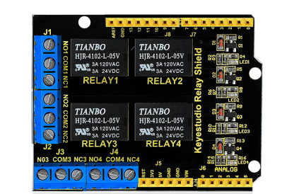
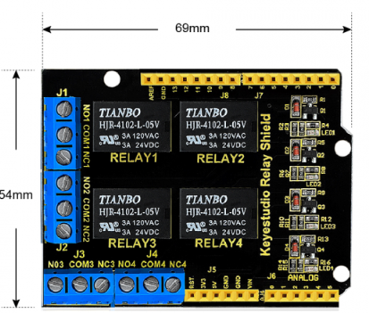
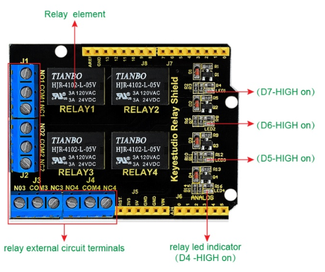
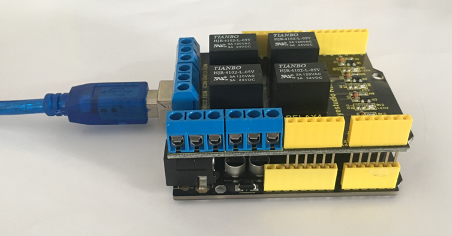
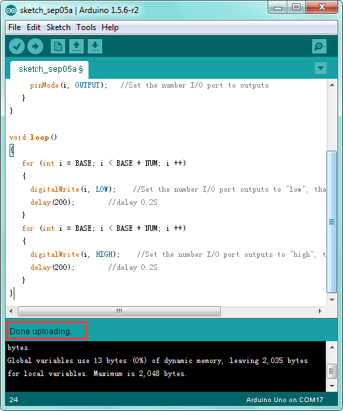
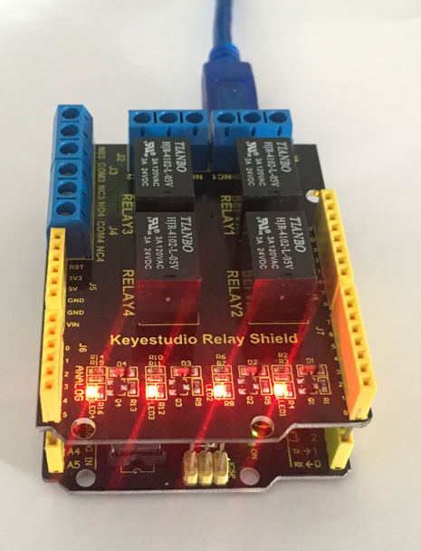

# KS0251 keyestudio 4-channel Relay Shield



## 1. Introduction

The keyestudio relay shield has integrated a 4-channel 5V relay module, which is fully compatible with UNO R3 control board. 

The 4-channel relay on the shield is active at HIGH level. Separately connect the 4-channel relay to the digital port 4, 5, 6, 7 on the UNO R3 board, then through controlling output HIGH or LOW to control the relay on and off.

## 2. Features

- The relay shield is 5V active HIGH
- Contact capacity: AC120V / 3A ; DC24V/3A
- Onboard LED indicator for relay output status
- Indicator: 4 LEDs are red when the relay is driven high, the corresponding indicator will light up.
- Standard interface can be directly connected with microcontrollers.
- Fully compatible with UNO R3 board
- Be able to control various appliances and other equipment with large current.
- 3 M3 screw positioning holes for easy installation
- Power Interface: 5V DC power interface
- Channel: 4 channel
- PCB Color: Black

## 3. Details

- **Size:** 69mm*54mm*26mm
- **Weight:** 39.4g



## 4. PINOUTS



**Relay Terminals:**

- Terminal high-power, high-current high voltage can be connected to the device.
- When D4 is High, RELAY 4 turns on, LED4 lights up, COM4 and NO4 connected, COM4 and NC4 disconnected. If D4 is LOW, RELAY 4 turns off, LED4 not light, COM4 and NO4 disconnected, COM4 and NC4 connected.
- When D5 is High, RELAY 3 turns on, LED3 lights up, COM3 and NO3 connected, COM3 and NC3 disconnected. If D5 is LOW, RELAY 3 turns off, LED3 not light, COM3 and NO3 disconnected, COM3 and NC3 connected.
- When D6 is High, RELAY 2 turns on, LED2 lights up, COM2 and NO2 connected, COM2 and NC2 disconnected. If D6 is LOW, RELAY 2 turns off, LED2 not light, COM2 and NO2 disconnected, COM2 and NC2 connected.
- When D7 is High, RELAY 1 turns on, LED1 lights up, COM1 and NO1 connected, COM1 and NC1 disconnected. If D7 is LOW, RELAY 1 turns off, LED1 not light, COM1 and NO1 disconnected, COM1 and NC1 connected.

## 5. Hookup Guide

Simply stack the shield on the UNO board



## 6. Sample Code

Code download:   [Resources](./Resources.7z)

```c
int BASE = 4 ;  //The first relay is connected to the I / O port
int NUM = 4;   //Total number of relays

void setup()
{
   for (int i = BASE; i < BASE + NUM; i ++) 
   {
     pinMode(i, OUTPUT);   //Set the number I/O port to outputs
   }
}

void loop()
{
   for (int i = BASE; i < BASE + NUM; i ++) 
   {
     digitalWrite(i, LOW);    //Set the number I/O port outputs to "low", that is, gradually turn off the relay.
     delay(200);        //delay 0.2S
   }
   for (int i = BASE; i < BASE + NUM; i ++) 
   {
     digitalWrite(i, HIGH);    //Set the number I/O port outputs to "high", that is, gradually turn on relay.
     delay(200);        //delay 0.2S
   }  
}
```



## 7. Test Result

Done uploading the above code, you should see the 4-channel relay is first connected, and then disconnected one after another, repeatedly.

